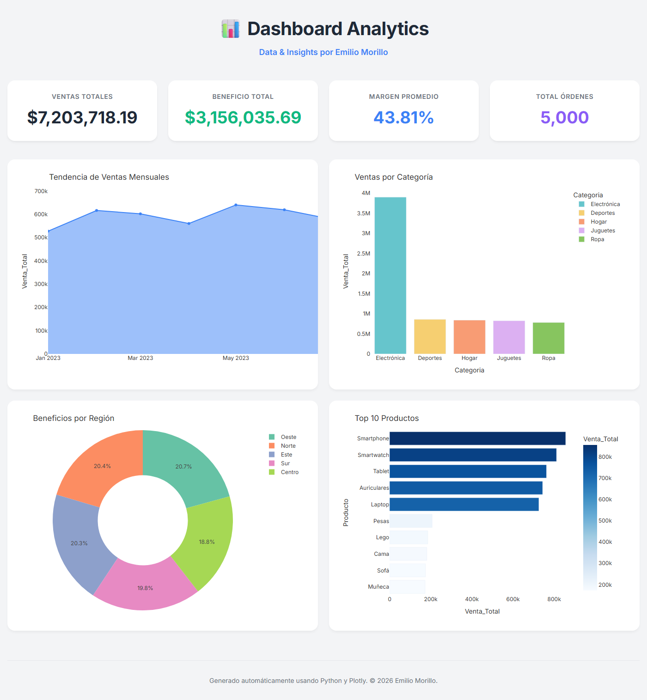
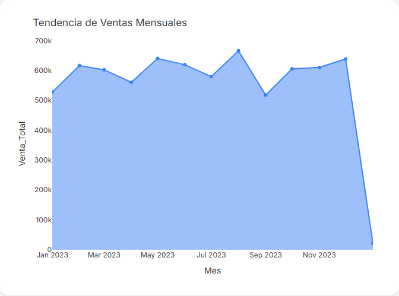

# 📊 Sales Analytics Dashboard

> **Data & Insights by Emilio Morillo**

[](https://MgnumX.github.io/analisis-ventas-dashboard/)
[](https://python.org)
[](https://plotly.com)



<details>
<summary>🔍 First chart — close-up</summary>



</details>

---

## 🇺🇸 English

I built this project to show a complete data workflow — from raw synthetic data generation all the way to an interactive, browser-ready KPI dashboard. No proprietary tools, no cloud lock-in. Just Python, Pandas, and Plotly doing what they do best.

### 💡 Key Insights

This dashboard is designed to answer real business questions, for example:

1. **Which product categories drive the most revenue?**
   — The bar chart breaks down total sales by category, making it immediately clear where to focus sales strategy.

2. **How do monthly sales trends behave across the year?**
   — The area chart surfaces seasonality patterns and growth periods that would be invisible in a raw spreadsheet.

3. **Which regions generate the highest profit margins — and which are underperforming?**
   — The donut chart splits net profit by region, helping prioritize territory investments or identify distribution inefficiencies.

### ✨ Features

- **Synthetic Dataset (`generar_datos.py`)** — Generates `ventas.csv` with 5,000 realistic transaction records: dates, categories, products, regions, pricing, discounts, and margins.
- **KPI Processing (`generar_dashboard.py`)** — Computes Total Sales, Net Profit, Average Margin, and Order Count from raw data.
- **Interactive Dashboard** — A self-contained `dashboard.html` powered by Plotly. No server required — open it locally or host it anywhere.
- **Headless Screenshots (`capture_preview.py`)** — Uses Playwright + Chromium to capture `preview.png` (full page) and `preview_chart1.png` (first chart crop) without opening a browser window.

### 🚀 Setup

Python 3.8+ required.

```bash
pip install pandas numpy plotly playwright
playwright install chromium
```

### 🛠️ How to Run

```bash
# Step 1 — Generate the dataset
python generar_datos.py

# Step 2 — Build the dashboard
python generar_dashboard.py

# Step 3 — Open dashboard.html in your browser

# Step 4 (optional) — Capture screenshots silently
python capture_preview.py
```

### 📂 Project Structure

```text
.
├── generar_datos.py       # Synthetic data generator
├── generar_dashboard.py   # Data processing + Plotly dashboard builder
├── capture_preview.py     # Headless screenshot capture via Playwright
├── ventas.csv             # Generated dataset
├── dashboard.html         # Final interactive dashboard
├── preview.png            # Full-page screenshot
├── preview_chart1.png     # First chart crop
└── README.md              # This file
```

---

## 🇪🇸 Español

Construí este proyecto para mostrar un flujo de trabajo de datos completo — desde la generación de datos sintéticos hasta un dashboard interactivo de KPIs listo para el navegador. Sin herramientas propietarias ni dependencias de nube. Solo Python, Pandas y Plotly haciendo lo que mejor saben hacer.

### 💡 Insights Clave

Este dashboard está diseñado para responder preguntas reales de negocio, por ejemplo:

1. **¿Qué categorías de producto generan más ingresos?**
   — El gráfico de barras desglosa las ventas totales por categoría, dejando claro de inmediato dónde enfocar la estrategia comercial.

2. **¿Cómo se comporta la tendencia de ventas mes a mes a lo largo del año?**
   — El gráfico de área muestra patrones de estacionalidad y periodos de crecimiento que serían invisibles en una hoja de cálculo cruda.

3. **¿Qué regiones generan los mayores márgenes de beneficio — y cuáles están por debajo?**
   — El gráfico de dona divide el beneficio neto por región, ayudando a priorizar inversiones o detectar ineficiencias de distribución.

### ✨ Características

- **Dataset Sintético (`generar_datos.py`)** — Genera `ventas.csv` con 5,000 registros de transacciones realistas: fechas, categorías, productos, regiones, precios, descuentos y márgenes.
- **Procesamiento de KPIs (`generar_dashboard.py`)** — Calcula Ventas Totales, Beneficio Neto, Margen Promedio y Cantidad de Órdenes desde los datos en bruto.
- **Dashboard Interactivo** — Un `dashboard.html` autocontenido impulsado por Plotly. No requiere servidor — ábrelo localmente o hospédalo en cualquier lugar.
- **Screenshots Headless (`capture_preview.py`)** — Usa Playwright + Chromium para capturar `preview.png` (página completa) y `preview_chart1.png` (recorte del primer gráfico) sin abrir ventana de navegador.

### 🚀 Configuración

Requiere Python 3.8 o superior.

```bash
pip install pandas numpy plotly playwright
playwright install chromium
```

### 🛠️ Cómo Ejecutar

```bash
# Paso 1 — Generar el dataset
python generar_datos.py

# Paso 2 — Compilar el dashboard
python generar_dashboard.py

# Paso 3 — Abrir dashboard.html en tu navegador

# Paso 4 (opcional) — Capturar screenshots silenciosamente
python capture_preview.py
```

### 📂 Estructura del Proyecto

```text
.
├── generar_datos.py       # Generador de datos sintéticos
├── generar_dashboard.py   # Procesamiento de datos + constructor del dashboard
├── capture_preview.py     # Captura de screenshots headless via Playwright
├── ventas.csv             # Dataset generado
├── dashboard.html         # Dashboard interactivo final
├── preview.png            # Screenshot de página completa
├── preview_chart1.png     # Recorte del primer gráfico
└── README.md              # Este archivo
```

---

*Built to turn raw data into actionable strategy. / Construido para transformar datos crudos en estrategias accionables.*
